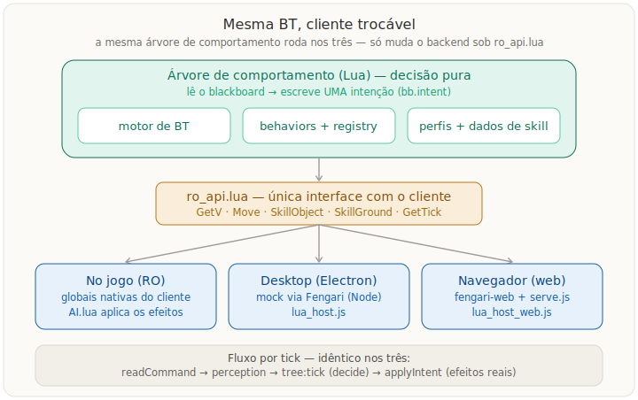

# BR-AI

[](https://github.com/SEU-USUARIO/br-ai/actions/workflows/ci.yml)  [](LICENSE)
<!-- Troque SEU-USUARIO pelo seu usuário/organização do GitHub após criar o repositório. -->

IA de homúnculos do **Ragnarok Online** baseada em **árvores de comportamento** (BT) em Lua, reimplementando o AzzyAI de forma incremental. A **mesma árvore** roda em três lugares sem alteração: dentro do cliente do RO, num **simulador/depurador** desktop (Electron) e agora também **no navegador**. Visão completa de design em [`DESIGN.md`](DESIGN.md); guias detalhados em [`docs/`](docs/).

O segredo é a separação "mesma BT, cliente trocável": a árvore é **decisão pura** (lê o blackboard e escreve uma intenção), e a única interface com o mundo é `lua/src/core/ro_api.lua` — no jogo aponta para as globais nativas, no simulador para um mock.



## Início rápido

Existem três formas de usar o BR-AI.

### 1. No navegador (mais rápido para experimentar)

Editor de árvores + simulador rodando no navegador, lendo e gravando as pastas reais do projeto. Precisa só de Node.

```bash
cd desktop
npm install
npm run web
```

Abra **http://localhost:8000/desktop/web/**. Detalhes em [`desktop/web/README.md`](desktop/web/README.md).

### 2. App desktop (Electron)

A mesma UI como aplicativo nativo:

```bash
cd desktop
npm install
npm start
```

### 3. No jogo (RO)

No editor, clique em **Gerar Lua** para produzir um pacote auto-suficiente em `trees/<nome>/dist/` (+ um `.zip`). Extraia o conteúdo dentro de `<pasta do RO>/AI/USER_AI/` e, no jogo, ative com **/hoai** (digite de novo para desligar).

## Estrutura

```
br-ai/
├── lua/                       # A IA: motor de BT + behaviors (roda no jogo e no sim)
│   ├── AI.lua                 # entrada no cliente do RO; define AI(myid)
│   ├── bootstrap.lua          # ordem de carga dos módulos (namespace global BRAI)
│   └── src/
│       ├── core/              # ro_api (interface única), blackboard, perception, util, const
│       ├── bt/                # status, node, composites, decorators, tree (builder)
│       ├── behaviors/         # conditions, combat, survival, commands, idle, skills
│       ├── data/              # perfis por tipo de homúnculo + dados de skills (Renewal)
│       ├── registry.lua       # fonte única de condições/ações (paleta do editor)
│       └── sim/               # mock do cliente + runtime do simulador (só fora do jogo)
├── desktop/                   # App Electron + versão web
│   ├── editor/                # editor visual de árvores (grafo)
│   ├── renderer/              # simulador/depurador (mapa, timeline, árvore ao vivo)
│   ├── web/                   # MESMA UI no navegador (npm run web) — ver web/README.md
│   ├── main.js / preload.js   # processo principal + ponte IPC do Electron
│   └── lua_host.js            # embute a Lua via Fengari
├── trees/<nome>/tree.json     # árvores salvas (FONTE DA VERDADE; o Lua é gerado)
├── scenarios/*.json           # cenários do simulador (casos de teste/regressão)
├── monsters.json              # catálogo global de monstros/grupos (nós monsterCheck)
├── tools/                     # codegen (build_tree.js) + testes Lua (*_test.lua)
├── docs/                      # guias (editor, simulador, arquitetura, referência de nós)
└── DESIGN.md                  # visão completa de design
```

## Editor e simulador

O **editor** monta a árvore como um grafo de arrastar-e-soltar; a paleta e a validação vêm dos comportamentos reais registrados no motor, e há seletor de skills por tipo de homúnculo (e tipo base, para Homunculus S). O **simulador** roda a mesma árvore Lua contra um mundo falso, com controle de tempo (passo a passo, replay), inspetor de blackboard e a **árvore colorida ao vivo** (cada nó pintado pelo status do tick). Guias: [`docs/guia-editor.md`](docs/guia-editor.md) e [`docs/guia-simulador.md`](docs/guia-simulador.md). Referência de todos os nós: [`docs/referencia-nos.md`](docs/referencia-nos.md).

### Árvores e cenários de exemplo

Inclusos para demonstração (Homunculus S, os mais usados):

- `trees/Sera - Vanilmirth/` — atacante à distância: Needle/Poison Mist, Summon Legion, Painkiller no dono e cura (Chaotic) **herdada da base Vanilmirth**; ramo `monsterCheck` para chefes.
- `trees/Dieter - Amistr Vitrine/` — AoE DoT (Lava Slide), buffs em `parallel`, **Castling herdado da base Amistr** e debuff de chefe (Volcanic Ash) com `cooldown`.
- `scenarios/` — `1 - Basico` (seguir/atacar), `2 - Sera - Caca em grupo` (bando + chefe), `3 - Dieter - Defesa do dono (Castling)`.

## Testes

Os harnesses offline rodam a IA fora do jogo contra um mundo falso. Requerem um interpretador Lua (`lua` 5.1+; sem ele, `texlua` do TeX Live serve). Da raiz do repo:

```bash
lua tools/bt_test.lua        # principal — esperado: "RESULTADO: 30 ok, 0 falhas"
texlua outputs_chk.lua       # checagem rápida de sintaxe dos módulos-chave
```

Cada `tools/<área>_test.lua` é um teste independente (ex.: `homun_test.lua`, `chase_test.lua`, `priority_test.lua`). No desktop, `npm run host-smoke` valida a ponte JS↔Lua via Fengari sem UI.

## Princípios

- **Mesma BT em Lua roda no jogo, no simulador e no navegador** — só muda o backend de `ro_api.lua`.
- **Decisão pura**: a árvore lê o blackboard e escreve UMA intenção; os efeitos reais (`Move`/`Attack`/`Skill`) saem só na camada de ação (`AI.lua`/`applyIntent`).
- **Spec é o contrato**: a fonte da verdade de uma árvore é o JSON (`trees/<nome>/tree.json`); o `tree_homun.lua` é **gerado** — não edite à mão.
- **Código portável** (subconjunto Lua 5.0/5.1) para se comportar igual no cliente (5.0) e ser testável numa VM moderna.

## Documentação

- [`DESIGN.md`](DESIGN.md) — visão completa de design.
- [`PLANO-PARIDADE-AZZYAI.md`](PLANO-PARIDADE-AZZYAI.md) — plano de paridade com o AzzyAI.
- [`docs/arquitetura.md`](docs/arquitetura.md) · [`docs/desenvolvimento.md`](docs/desenvolvimento.md) · [`docs/guia-editor.md`](docs/guia-editor.md) · [`docs/guia-simulador.md`](docs/guia-simulador.md) · [`docs/referencia-nos.md`](docs/referencia-nos.md)
- [`desktop/web/README.md`](desktop/web/README.md) — a versão de navegador em detalhe.

## Créditos

O BR-AI reimplementa, em **árvore de comportamento**, a IA de homúnculos **AzzyAI 1.56**
(criada por *Azzy*). Os dados de skill (alcance, SP, cast, recarga) e o comportamento
de referência vêm do AzzyAI; o motor de BT, o editor visual e o simulador são originais.
Crédito a Azzy e à comunidade de Ragnarok Online. A fonte original do AzzyAI foi usada
apenas como referência e **não** é redistribuída neste repositório.

## Licença

[MIT](LICENSE) © Guilherme Barros.
